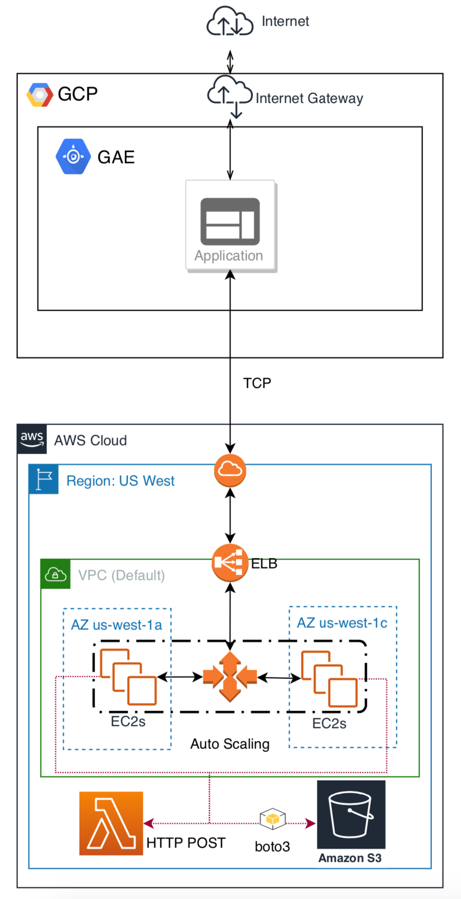
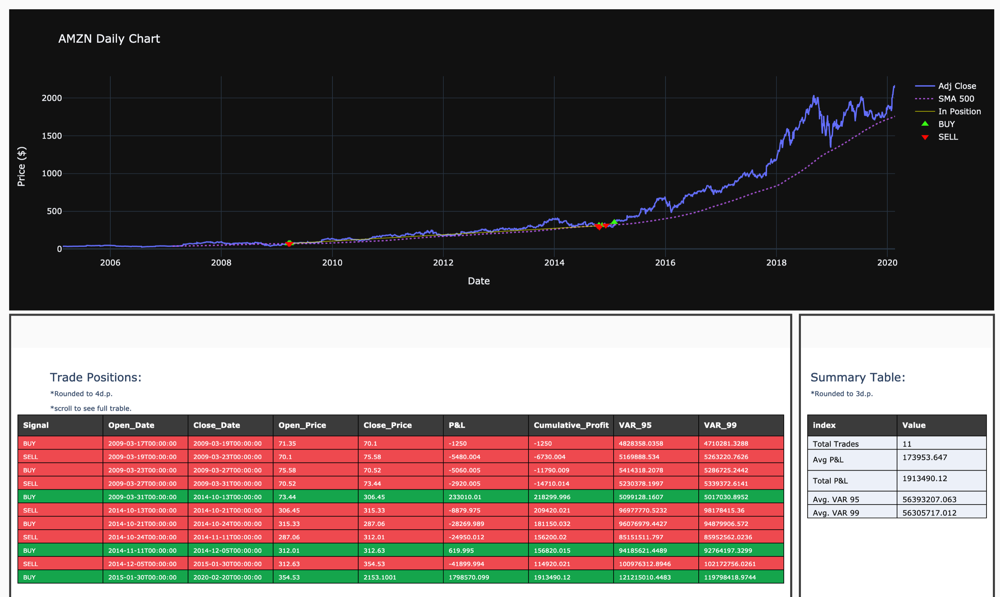

# Trade-Analysis-SAAS

[Trade-Analysis SaaS](https://trade-analysis-cloud-app.appspot.com) is a multi-cloud scalable Software as a Service (SaaS) for analysing a trading strategy by determining the Value at Risk (VaR) using Monte-Carlo Simulation.

#### Technologies:
+ Python Flask
+ Cloud Computing (GCP & AWS)
+ Serverless Computing (AWS Lambda)
+ Boto3 & AWSCLI
+ Socket Programming
+ Parallel Programming (Multi-Processing & Threading)
+ Financial Time-Series Processing
+ Data Visualisations (Plotly)

----

#### Architecture:
The system is designed in a way that underlying cloud resources from AWS and GCP are used dynamically to gain maximum efficiency with minimum cost. The architecture diagram below represents a high-level view of the components of the system.

#### Major System Components:
###### Google App Engine (GAE):
GAE (PaaS) acts as the internet-facing host server where the main Flask app resides. The computations on GAE have been limited to the minimum, meaning the only role here is to communicate with other components. On a new visit, the user is presented with a form. Upon submission of the form, several input validations are performed; if successful, the app proceeds with the next tasks, otherwise, the user is prompted to redefine the parameters according to specified warnings. Next, a pre-configured TCP connection is opened between GAE and a number of AWS components. In short, the user inputs are encoded and passed to EC2 instances and after certain calculations, the response is sent back to GAE for displaying, however, there are intermediate components.

###### Elastic Load Balancer (ELB):
Amazon's ELB is responsible for evenly distributing the traffic between instances. The ELB in use is the 'Classic Load Balancer', situated in the same VPC as instances and operates on all available subnets. It is associated with an 'Auto Scaling Group' so a new instance will automatically be linked to the ELB. Health check, a feature within ELB, is configured in a way that ELB ensures the availability of the instances periodically.

###### Auto Scaling Group (ASG):
Amazon's ASG sets the strategy for automatically scaling out and in the system. The incorporated launch configuration defines which AMI, Security Group and IAM profiles to be used upon a new instance launch. Moreover, it determines what User Data should be executed to run the available python script on EC2, set up the server and start listening on a specific port. The scaling policies are defined as follows: Increase instances by 1, when average CPU utilisation crosses 60% for 60 consecutive seconds. Decrease by 1 instance when average CPU utilisation falls below 20% for 60 consecutive seconds. Each instance is given 70 seconds of warm-up time to encounter the time needed for the server to be running. Having a minimum and desired number of instances set to 1, and maximum to 10, enables the software to be scaled dynamically and automatically. Auto Scaling will happen in two availability zones of the default VPC within US-West-1 region.

###### EC2:
AWS EC2 (IaaS) is chosen as the additional scalable service. EC2 provides elasticity, meaning as the demand for the application changes, it is possible to change the number of running instances rapidly. This implies cost-efficiency can be achieved by appropriate strategies; terminating an instance when not needed is one of the ways to scale to zero. Moreover, EC2 instances are secure and easy to use; It is possible to manage the networks (e.g: subnets, VPC) and set various security groups for each instance. Finally, EC2 instances are inexpensive as a wide range of instance types are available to optimise a functionality (e.g: GPU optimised or Memory optimised). EC2 instances have two roles in the system: 1- Setting up a socket endpoint and start listening on a specified port which is achieved by executing the `server_ec2.py` Python script. 2- Performing required calculations on the user inputs to generate the final response, this includes preprocessing the data, providing trade signals, calculating VAR on the EC2 itself or calling AWS Lambda for VAR calculations, depending on the user input. Python script `ec2_process.py` is responsible for all these computation related tasks.

###### AWS Lambda:
Lambda is used as the serverless computing component and only called for VAR calculation if required by the user's input.

###### AWS S3:
S3 bucket stores stock data files (CSVs).

#### System Component Interactions:
As shown in the figure above, GAE is the host server, once a user successfully submits the form, the user inputs are stored in an encoded pickle file. Then a TCP:5555 connection is established between GAE and the ELB's DNS. The load balancer ensures the availability of instances by regularly pinging their local IP. EC2 instances and ELB are both operating in the same VPC and the public IP of EC2 instances are not exposed to the internet. Moreover, the security group on EC2 only allows incoming connections from ELB which increases security.
Next, ELB forwards incoming TCP:5555 (from GAE) to an available socket endpoint (TCP:5555) on EC2.
`server_ec2.py` on EC2 instance will decode received user inputs and pass it as the argument of `ec2_process.generate_result()` function. Based on the user's input, `ec2_process.py` will download the required stock data from the S3 bucket, using `boto3` API and start processing data. Once the data is ready for VAR calculation, the VAR is generated either on EC2 or Lambda depending on user input. In case Lambda was chosen, an HTTP post request is sent to API Gateway of Lambda and after Lambda's calculations, the response is sent back to EC2.
Finally, once the result, which contains Time-series plot, Trades Tables and Summary Table, is ready, it is sent back to the ELB and ultimately to GAE. The TCP connection with the client is closed by EC2 server and upon a new submission of the form, the cycle is repeated.
GAE receives the response, decodes it and renders home.html with the plot and tables passed as arguments for displaying.

#### Characteristics:
The resources will be shared among several consumers (Resource pooling/Multi-tenancy) with the ability to scale up/down (Rapid elasticity) via the internet (Broad network access). The usage of resources is measured and informed to the developer through the built-in functionalities (Measured service) and the developer can set up and use these resources without requiring human interaction with each service provider (On-demand self-service). Therefore, meeting all essential characteristics defined by [NIST](https://nvlpubs.nist.gov/nistpubs/Legacy/SP/nistspecialpublication800-145.pdf).

<small>Developer: [Reza N](https://github.com/rezan21)</small>